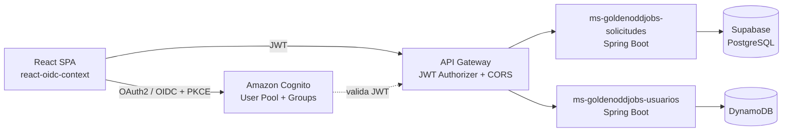

# Golden-Oddjobs

Plataforma que conecta a personas que necesitan una aplicación (móvil, web o de escritorio) con desarrolladores que quieren construirla. Proyecto desarrollado para el ramo **Desarrollo Cloud Native I (DSY1107)** — Duoc UC.

## Descripción

Un **Solicitante** publica lo que necesita, uno o varios **Desarrolladores** se postulan con un precio, el Solicitante elige con quién trabajar y negocian los detalles por chat. El sistema emula un pago dividido en dos partes (50% al iniciar el desarrollo, 50% + propina al finalizar). Un **Admin** supervisa el estado general de la plataforma.

### Roles

| Rol | Puede hacer |
|---|---|
| **Solicitante** | Publicar solicitudes, ver el estado de sus solicitudes, ver quién se postuló y a qué precio, contactar al desarrollador elegido |
| **Desarrollador** | Configurar su stack/skills, ver solicitudes disponibles, postularse con un precio |
| **Admin** | Ver todas las solicitudes de la plataforma, sin filtro por dueño |

El registro es **self-service**: cualquiera puede crear una cuenta y elegir si es Solicitante o Desarrollador. El rol de Admin nunca es autoasignable — se crea siempre a mano.

## Arquitectura

El frontend nunca habla directo con los microservicios: todo pasa por API Gateway, que valida el JWT (firma, issuer, audience) antes de rutear la petición al backend correspondiente. Cada microservicio vuelve a validar el token de forma independiente (defensa en profundidad) y aplica control de acceso por rol leyendo el claim `cognito:groups`.

## Stack tecnológico

**Frontend**
- React + Vite
- `react-oidc-context` / `oidc-client-ts` — login vía Cognito Hosted UI (Authorization Code + PKCE)
- `amazon-cognito-identity-js` — registro propio con selección de rol
- React Router, Axios

**Backend** (2 microservicios independientes)
- Java 21 + Spring Boot 3
- Spring Security (OAuth2 Resource Server) — validación de JWT
- Spring Data JPA + PostgreSQL (Supabase) — `ms-goldenoddjobs-solicitudes`
- AWS SDK v2 (DynamoDB Enhanced Client + Cognito Identity Provider) — `ms-goldenoddjobs-usuarios`

**Identidad**
- Amazon Cognito — User Pool, Groups (SOLICITANTE / DESARROLLADOR / ADMIN), App Client tipo SPA

**Infraestructura (AWS)**
- VPC propia con subred pública + Internet Gateway
- EC2 (Amazon Linux 2023) + Docker Compose
- API Gateway (HTTP API) — JWT Authorizer, CORS, rutas hacia los microservicios
- Desplegado sobre AWS Academy Learner Lab

## Estructura de repos

| Repo | Contenido |
|---|---|
| `frontend-golden-oddjobs` | SPA en React |
| `ms-goldenoddjobs-solicitudes` | Microservicio de solicitudes y postulaciones (Supabase). Incluye `infra/` con el `docker-compose.yml` que levanta ambos microservicios |
| `ms-goldenoddjobs-usuarios` | Microservicio de perfil de usuario (DynamoDB) y asignación de rol post-registro |

## Endpoints principales

| Método | Ruta | Rol requerido | Servicio |
|---|---|---|---|
| POST | `/api/solicitudes` | SOLICITANTE | solicitudes |
| GET | `/api/solicitudes/disponibles` | DESARROLLADOR | solicitudes |
| POST | `/api/solicitudes/{id}/postulaciones` | DESARROLLADOR | solicitudes |
| GET | `/api/admin/solicitudes` | ADMIN | solicitudes |
| GET | `/api/usuarios/perfil` | Cualquier rol autenticado | usuarios |
| POST | `/api/auth/asignar-grupo` | Público (uso interno, justo después del registro) | usuarios |

## Seguridad

- Login mediante OAuth 2.0 / OpenID Connect, flujo **Authorization Code con PKCE**.
- El backend valida el JWT recibido: firma, expiración, issuer y **audience** — los access token de Cognito no traen `aud`, así que se valida el claim `client_id` en su lugar.
- Control de acceso por rol vía el claim `cognito:groups`, mapeado a `ROLE_<GRUPO>` de Spring Security.
- El endpoint `/api/auth/asignar-grupo` es público a propósito (se llama antes de que exista sesión), pero solo permite asignar SOLICITANTE o DESARROLLADOR — nunca ADMIN.

## Variables de entorno

Cada componente trae su propio `.env.example` con las variables que necesita (Cognito, Supabase, credenciales de AWS, URLs de servicios). Ninguno de los `.env` reales se sube al repo — están excluidos vía `.gitignore`.

## Cómo levantar el proyecto

1. Clonar los 3 repos.
2. Backend: copiar `.env.example` a `.env` en `infra/` con los datos reales (Cognito, Supabase, credenciales de AWS) y correr `docker-compose up --build -d`.
3. Frontend: copiar `.env.example` a `.env` con la URL del API Gateway y los datos de Cognito, luego `npm install && npm run dev`.

